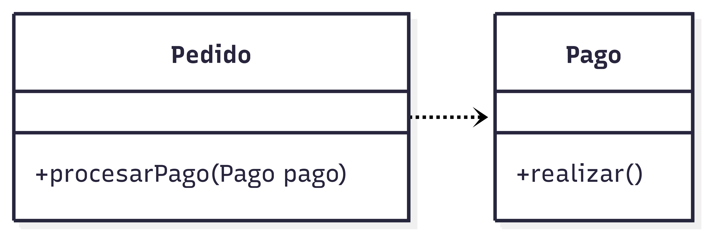
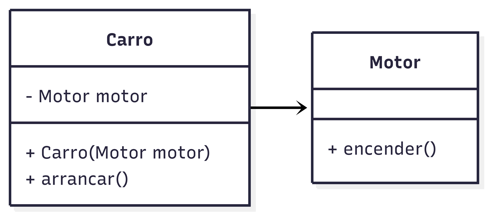
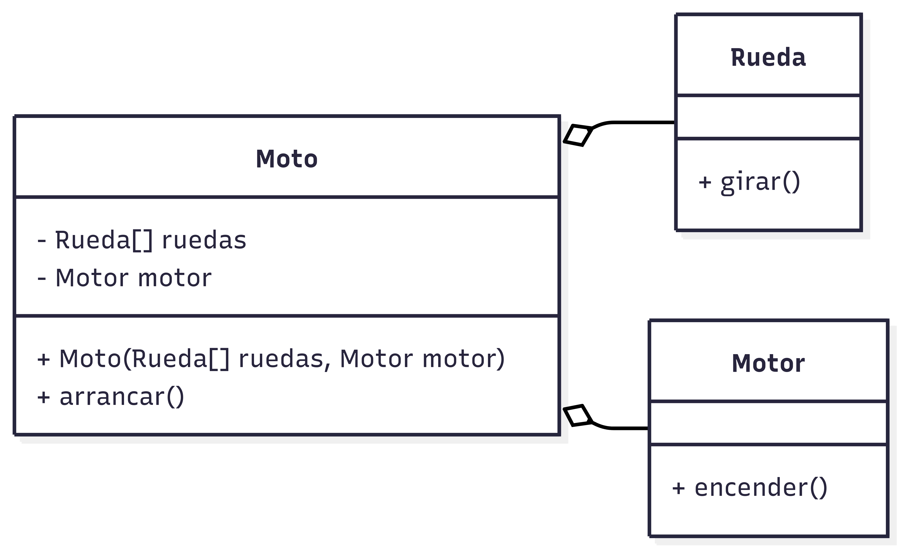
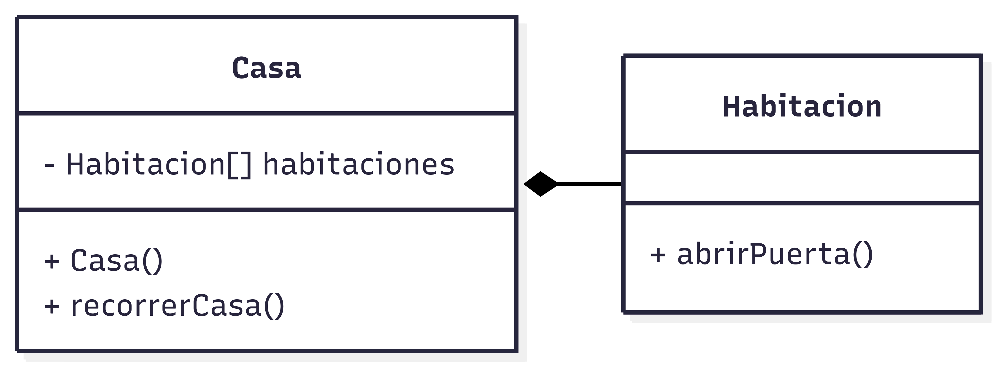

# Relaciones entre Clases
Semestre 02, 2025


## Introducción


En la programación orientada a objetos, las **relaciones entre clases** permiten definir cómo interactúan y se comunican los distintos componentes de un sistema.


### Relaciones Comúnes

- **Dependencia**: Clase A usa Clase B
- **Asociación**: Clase A tiene-a Clase B (has-a)
- **Agregación**: Asociación todo-parte
- **Composición**: Asociación fuerte todo-parte
- **Herencia**: Clase A es-una Clase B (is-a) (solo mención aquí)


## Dependencia


Clase A **usa** Clase B temporalmente.


Una relación de **dependencia** ocurre cuando una clase necesita usar otra clase de manera **temporal** para realizar una operación o tarea específica. 


No existe un vínculo permanente: la clase dependiente solo requiere de la otra en ciertos métodos o bloques de código.


Ocurre cuando A invoca métodos de B o recibe objetos de B como parámetros.


**Ejemplo**

Un **"Pedido"** depende de **"Pago"** para procesar un cobro. Sin embargo, el Pedido no guarda un atributo de tipo Pago: solo necesita usarlo en el momento de realizar la transacción.


**UML**



**Java:**
```java[]
public class Pago {
    public void realizar() {
        System.out.println("Pago realizado.");
    }
}
```


```java[]
public class Pedido {
    public void procesarPago(Pago pago) {
        pago.realizar();
    }
}
```


```java[]
public class Main {
    public static void main(String[] args) {
        Pago pago = new Pago();

        Pedido pedido = new Pedido();
        pedido.procesarPago(pago);
    }
}
```


Aquí `Pedido` depende de `Pago` únicamente en el método `procesarPago()`. No existe una relación de atributo entre las clases.


## Asociación


Clase A **tiene-a** Clase B (has-a).


Una relación de **asociación** ocurre cuando una clase tiene uno o más atributos que son instancias de otra clase. Esta relación es más **permanente** que la dependencia y representa un vínculo lógico entre las clases.


Se utiliza cuando un objeto forma parte del estado de otro objeto.


**Ejemplo**

Un **"Carro"** tiene un **"Motor"** como atributo. La relación existe mientras el Carro exista, pero el Motor puede ser compartido o reemplazado.


**UML**



**Java:**
```java[]
public class Motor {
    public void encender() {
        System.out.println("Motor encendido.");
    }
}
```


```java[]
public class Carro {
    private Motor motor;

    public Carro(Motor motor) {
        this.motor = motor;
    }

    public void arrancar() {
        motor.encender();
    }
}
```


```java[]
public class Main {
    public static void main(String[] args) {
        Motor motor = new Motor();

        Carro carro = new Carro(motor);
        carro.arrancar();
    }
}
```


Aquí `Carro` **tiene-a** `Motor` como atributo. La relación es directa y más estable que la dependencia.


## Agregación 


Una relación de **agregación** ocurre cuando una clase tiene objetos de otra clase como atributos, pero esas partes pueden existir **independientemente** del todo.


Esta relación se describe como un vínculo "todo-parte" débil.


**Ejemplo**

Una **"Moto"** está compuesta por **"Ruedas"** y un **"Motor"**. Si la Moto deja de existir, las Ruedas y el Motor aún pueden existir por separado.


**UML**



**Java:**
```java[]
public class Rueda {
    public void girar() {
        System.out.println("La rueda está girando.");
    }
}
```


```java[]
public class Motor {
    public void encender() {
        System.out.println("Motor encendido.");
    }
}
```


```java[]
public class Moto {
    private Rueda[] ruedas;
    private Motor motor;

    public Moto(Rueda[] ruedas, Motor motor) {
        this.ruedas = ruedas;
        this.motor = motor;
    }

    public void arrancar() {
        motor.encender();
        for (Rueda rueda : ruedas) {
            rueda.girar();
        }
    }
}
```


```java[]
public class Main {
    public static void main(String[] args) {
        Rueda[] ruedas = { new Rueda(), new Rueda() };
        Motor motor = new Motor();
        
        Moto moto = new Moto(ruedas, motor);
        moto.arrancar();
    }
}
```


Aquí `Moto` **agrega** `Ruedas` y `Motor`. Aunque la Moto desaparezca, las Ruedas y el Motor pueden seguir existiendo.


## Composición 


Una relación de **composición** es una variante de la agregación donde las partes **no pueden existir independientemente** del todo. Si el objeto contenedor se destruye, también se destruyen sus partes.


**Ejemplo**

Una **"Casa"** tiene **"Habitaciones"**. Las habitaciones no tienen sentido fuera de la casa.


**UML**



**Java:**
```java
public class Habitacion {
    public void abrirPuerta() {
        System.out.println("Puerta abierta.");
    }
}
```


```java
public class Casa {
    private Habitacion[] habitaciones;

    public Casa() {
        habitaciones = new Habitacion[5];
        for (int i = 0; i < 5; i++) {
            habitaciones[i] = new Habitacion();
        }
    }

    public void recorrerCasa() {
        for (Habitacion h : habitaciones) {
            h.abrirPuerta();
        }
    }
}
```


```java
public class Main {
    public static void main(String[] args) {
        Casa casa = new Casa();
        casa.recorrerCasa();
    }
}
```


Aquí `Casa` **compone** `Habitaciones`. Las habitaciones son creadas y destruidas junto con la Casa.


## Herencia 
(is-a)


Relación **Clase A es-una Clase B**.


Coming Soon...


## Resumen


| Relación     | Definición                           | Ejemplo             |
|--------------|---------------------------------------|---------------------|
| Dependencia  | Uso temporal de otra clase           | `Pedido -> Pago`    |
| Asociación   | Atributo de una clase es otra clase  | `Carro -> Motor`    |


| Relación     | Definición                           | Ejemplo             |
|--------------|---------------------------------------|---------------------|
| Agregación   | Todo-parte (partes independientes)   | `Moto -> Rueda`     |
| Composición  | Todo-parte fuerte (partes dependientes) | `Casa -> Habitacion`|
