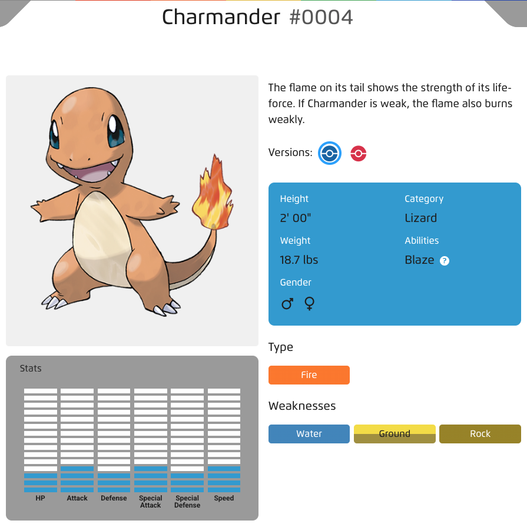
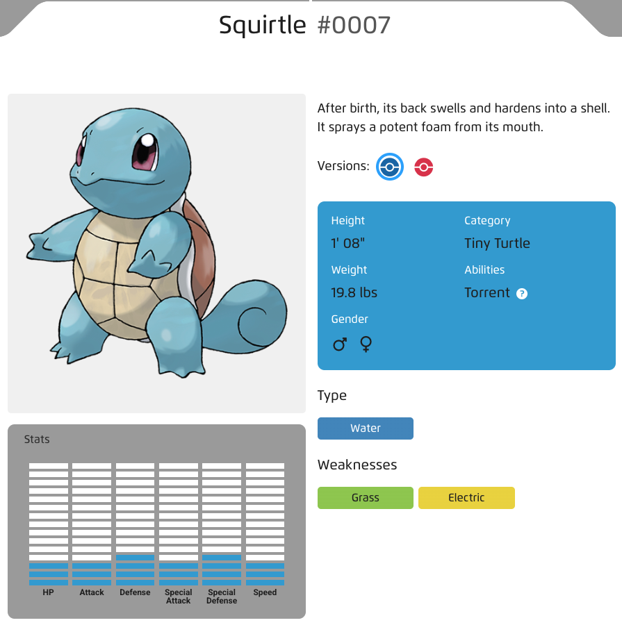
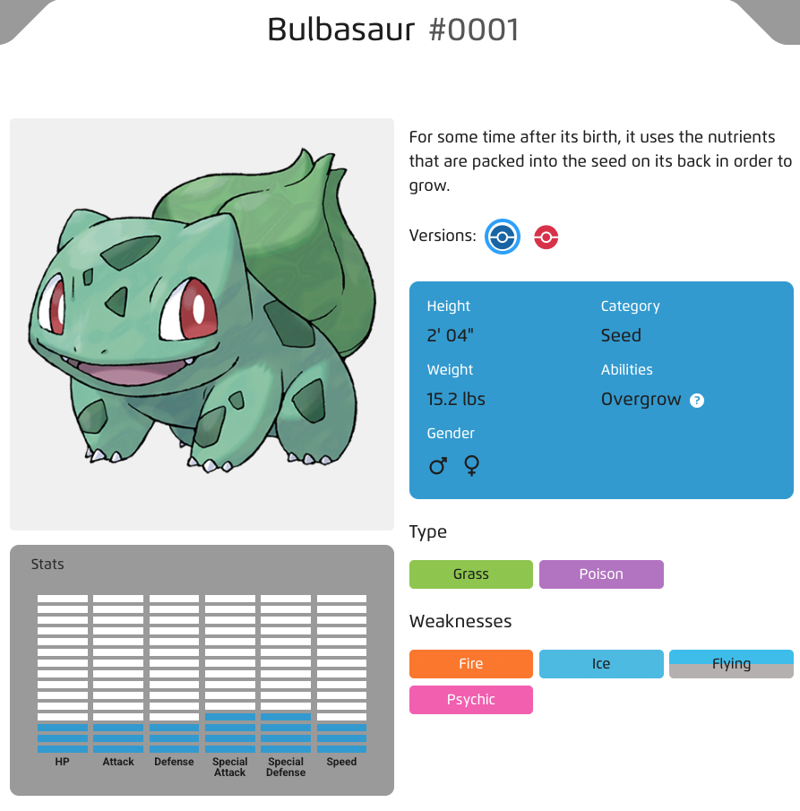
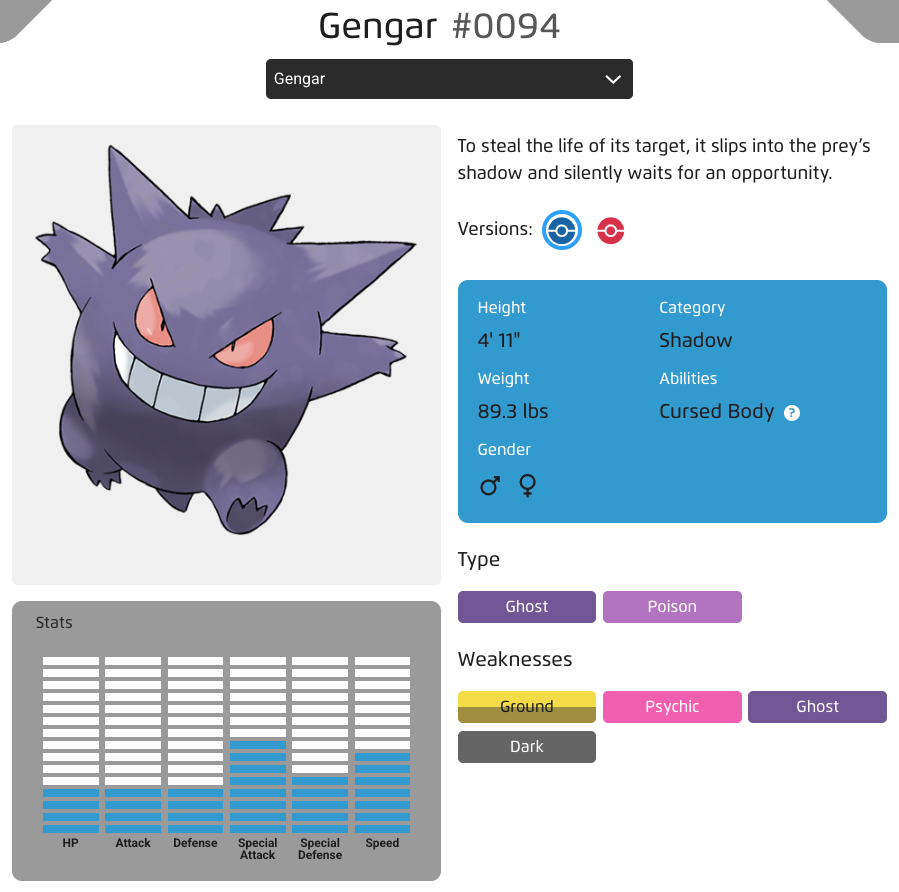

# Interfaces
Semestre 02, 2025


## Definición


Una interfaz es una colección de métodos abstractos que las clases deben definir.


Desde Java 8 también puede tener métodos por defecto y estáticos.


```java[]
interface Figura {
    double area();
    double perimetro();

    default void mostrarInfo() {
        System.out.println("Soy una figura geométrica.");
    }
}
```


```java[]
class Circulo implements Figura {
    private double radio;
    
    public Circulo(double r) { 
        this.radio = r; 
    }

    public double area() { 
        return Math.PI * radio * radio; 
    }

    public double perimetro() {
        return 2 * Math.PI * radio; 
    }
}
```


Características:

* No pueden tener atributos de instancia (solo constantes public static final).
* Los métodos son implícitamente public y abstract (a menos que sean default o static).
* Una clase puede implementar múltiples interfaces.


## Herencia múltiple vía interfaces


Java no permite herencia múltiple de clases, pero sí de interfaces.


Esto evita ambigüedades de implementación y fomenta un diseño más flexible.


```java[]
interface Volador {
    void volar();
}

interface Nadador {
    void nadar();
}
```


```java[]
class Pato implements Volador, Nadador {
    public void volar() {
        System.out.println("El pato vuela bajo.");
    }

    public void nadar() {
        System.out.println("El pato nada en Pana.");
    }
}
```


Ventajas:

* Se pueden combinar comportamientos de diferentes fuentes.
* Fomenta el diseño modular y extensible.


Si dos interfaces tienen el mismo método default, la clase debe sobreescribirlo para resolver el conflicto.


## Polimorfismo vía Interfaces


El polimorfismo permite que un mismo método o referencia se comporte de distintas formas según el tipo de objeto concreto que se esté utilizando.


Con interfaces, este principio se amplía: una interfaz define un contrato, y cualquier clase que la implemente puede ser usada de forma polimórfica.


```java[]
interface Animal {
    void hacerSonido();
}
```


```java[]
class Perro implements Animal {
    public void hacerSonido() {
        System.out.println("Guau");
    }
}

class Gato implements Animal {
    public void hacerSonido() {
        System.out.println("Miau");
    }
}
```


```java[]
public class Main {
    public static void main(String[] args) {
        Animal a1 = new Perro();
        Animal a2 = new Gato();

        a1.hacerSonido(); // Guau
        a2.hacerSonido(); // Miau
    }
}
```


Ventaja: Permite escribir código genérico que funciona con cualquier clase que implemente la interfaz.


## Intefaces útiles


### `Comparable`

Permite comparar objetos de un mismo tipo. Es clave para ordenar colecciones.


```java[]
class Persona implements Comparable<Persona> {
    private String nombre;
    private int edad;

    public Persona(String n, int e) {
        nombre = n;
        edad = e;
    }

    @Override
    public int compareTo(Persona otra) {
        return Integer.compare(this.edad, otra.edad);
    }

    @Override
    public String toString() { 
        return nombre + " (" + edad + ")"; 
    }
}
```


```java[]
List<Persona> lista = new ArrayList<>();
lista.add(new Persona("Ana", 22));
lista.add(new Persona("Luis", 30));
lista.add(new Persona("Carlos", 25));

Collections.sort(lista);
System.out.println(lista);
```


Resultado:

```
[Ana (22), Carlos (25), Luis (30)]
```


Ventaja: `Collections.sort()` puede utilizarse con cualquier clase que implemente `Comparable`.


### `Iterator`

Permite recorrer elementos de una colección sin exponer su estructura interna.


```java[]
import java.util.Iterator;

class Contador implements Iterator<Integer> {
    private int actual = 0;
    private final int max;

    public Contador(int max) {
        this.max = max;
    }

    @Override
    public boolean hasNext() {
        return actual < max;
    }

    @Override
    public Integer next() {
        return actual++;
    }
}
```


```java[]
public class Main {
    public static void main(String[] args) {
        Contador c = new Contador(5);
        
        while (c.hasNext()) {
            System.out.println(c.next());
        }
    }
}
```


Ventajas:

* Abstrae el recorrido (no se depende de índices ni del tipo de colección).
* Permite eliminar elementos de forma segura durante la iteración (`it.remove()`).








Clases: Pokemon (papa), Charmander (hijo), Squirtle (hijo).








🤔 Sería bueno hacer una interfaz 🤖